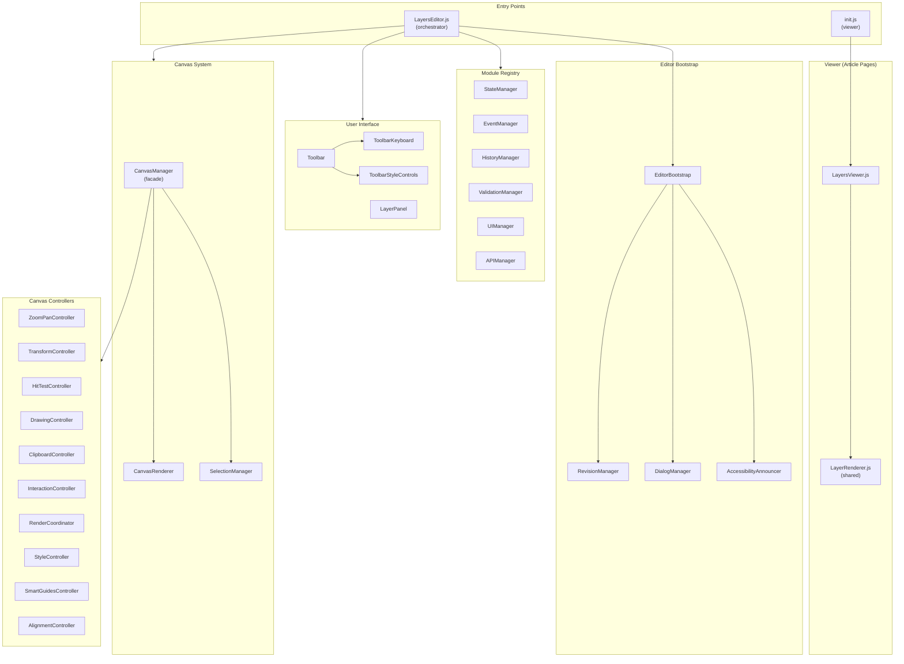
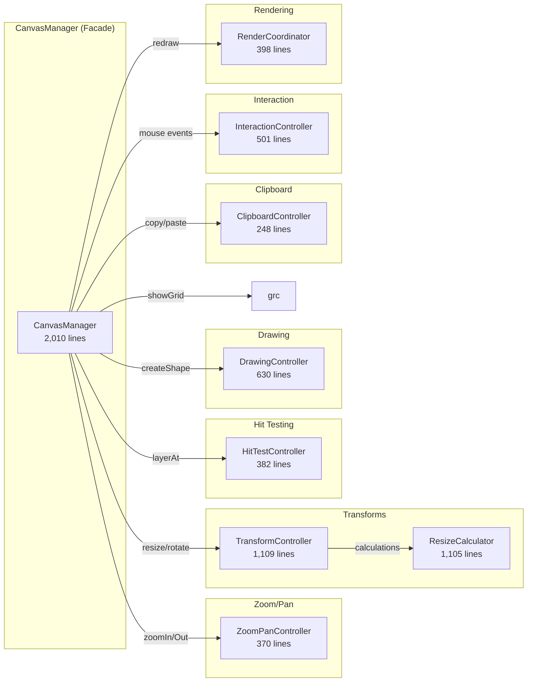
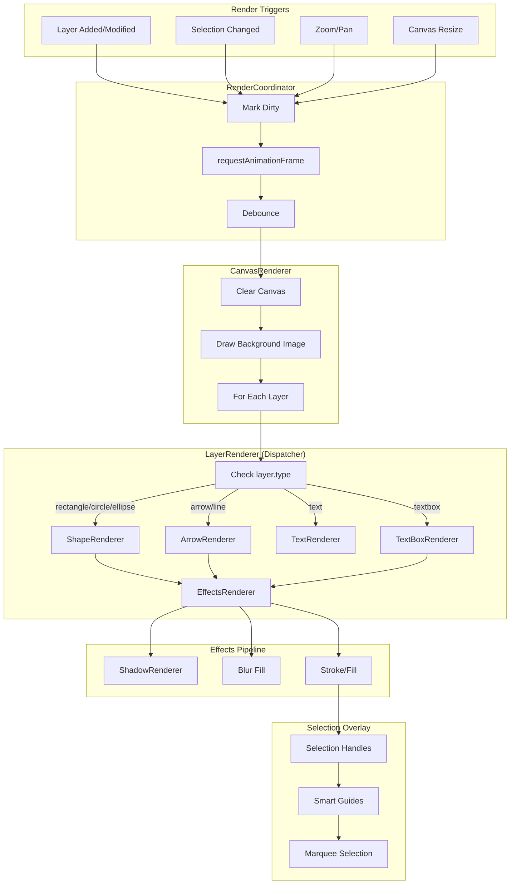
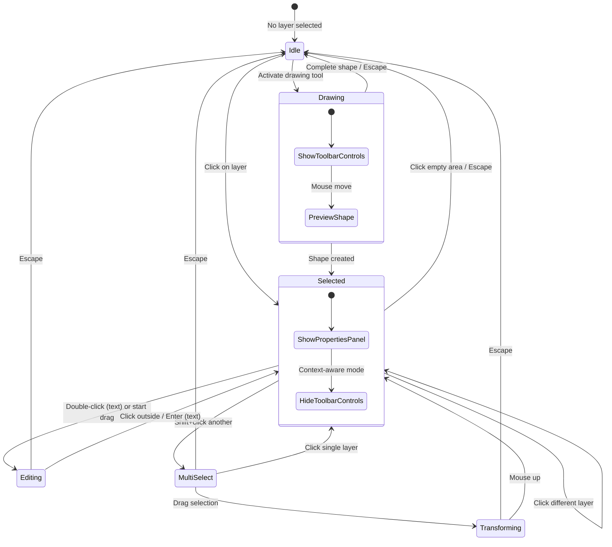
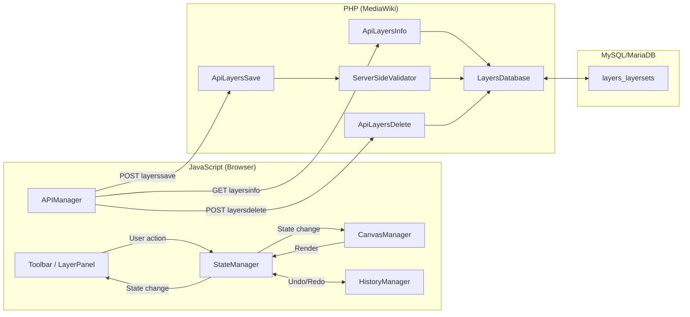
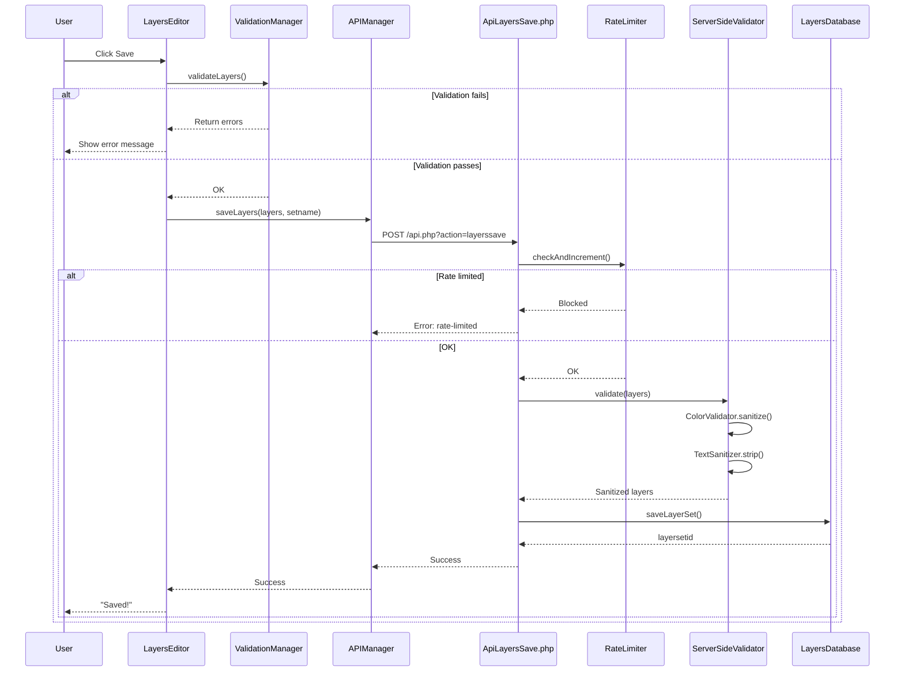
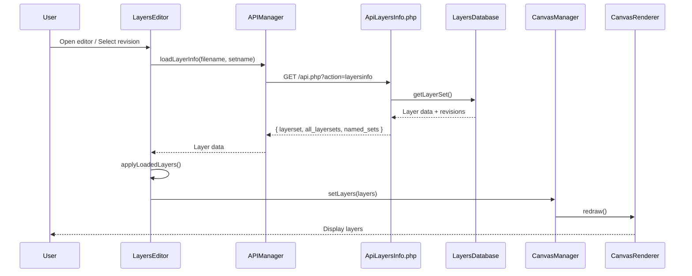
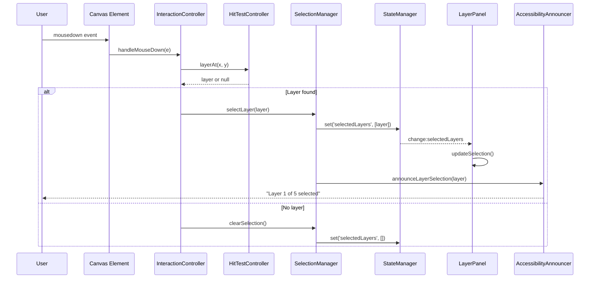
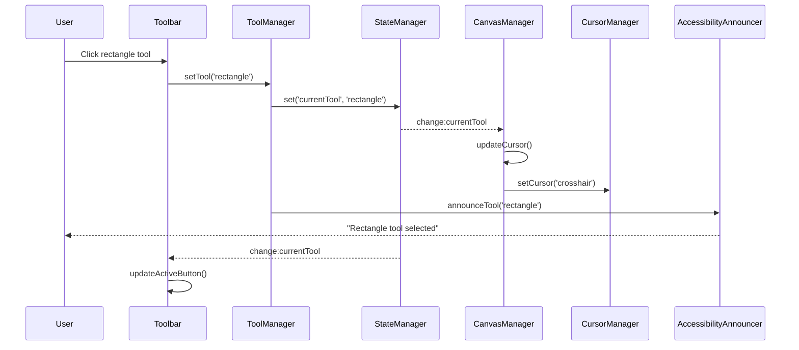
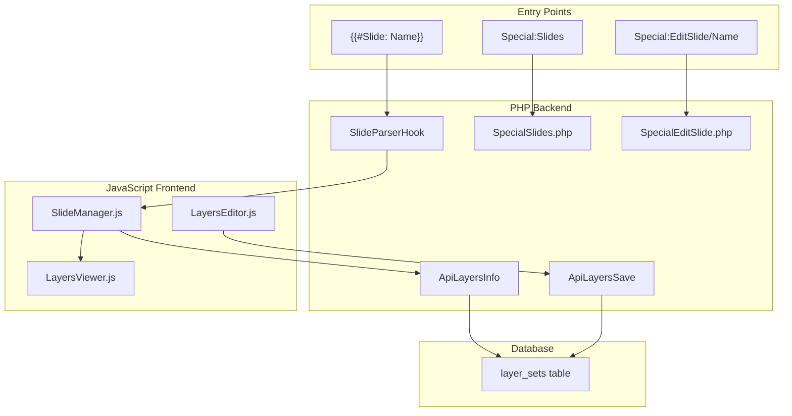

# Layers Extension Architecture

**Last Updated:** February 12, 2026
**Version:** 1.5.56

---

## Overview

The Layers extension enables non-destructive image annotation in MediaWiki. It consists of:

1. **PHP Backend** - MediaWiki integration, API endpoints, data persistence
2. **JavaScript Frontend** - Canvas-based editor UI, viewer rendering
3. **Slide Mode** - Standalone graphics without parent images (see [Slide Mode Architecture](#slide-mode-architecture))

The architecture follows strict separation of concerns: PHP handles storage and MW integration; JavaScript handles all UI/state.

---

## Codebase Statistics (February 12, 2026)

| Metric | Value |
|--------|-------|
| Total JS files | **139** |
| Total JS lines | **~96,144** |
| Total PHP files | **39** |
| Total PHP lines | **~15,308** |
| Viewer module | ~2,500 lines |
| Shared module | ~8,000 lines |
| Editor module | ~64,000 lines |
| Shape/Emoji data | ~14,354 lines (generated) |
| ES6 classes | **139** |
| Prototype patterns | 0 (100% ES6) |
| Test coverage | **95.19% stmt, 84.96% branch** |
| Jest tests | **11,152** (164 suites) |
| PHPUnit test files | 31 |
| God classes (>1000 lines) | **21** (2 generated, 17 JS, 2 PHP) |
| Drawing tools | **15** |
| Shape library | **5,116 shapes** |
| Emoji library | **2,817 emoji** |
| i18n messages | **741** |
| eslint-disable comments | **11** ✅ |

---

## Recent Architecture Changes

### January 2026: v1.5.26-v1.5.30

**v1.5.30 - Code Quality:**
- Layer search/filter feature in LayerPanel
- Raised Jest coverage thresholds (80% branches, 92% statements)
- Query simplification for `getNamedSetsForImage()`
- P1 security fixes (paths validation, cache invalidation)

**v1.5.27-v1.5.29 - Stability:**
- DraftManager subscription leak fix
- HistoryManager memory growth warning
- RGBA hex color support (8-digit)

### January 2026: v1.5.22-v1.5.25

**v1.5.25 - Slide Refresh Fix:**
- Added `pageshow` event listener in init.js for bfcache detection
- Slides now refresh immediately after editor close (like images)
- Added `refreshAllSlides()` to ViewerManager

**v1.5.22-v1.5.24 - Slide Mode:**
- New `{{#Slide: SlideName}}` parser function for standalone graphics
- `Special:Slides` management page
- `Special:EditSlide/SlideName` direct editor access
- Custom canvas sizes, background colors, view/edit overlays

### January 2026: v1.5.15-v1.5.20

**v1.5.20 - Virtual Scrolling:**
- VirtualLayerList.js for layer panels with 30+ layers
- DOM element recycling prevents memory issues
- Modal overlay UX fix (duplicate close button removed)

**v1.5.19 - Shared Utilities:**
- IdGenerator.js for unique layer ID generation
- ViewerManager error tracking improvements

**v1.5.18 - Critical Bug Fixes:**
- Non-existent layer set handling fixed
- Edit overlay initialization for missing sets

**v1.5.15 - Hover Overlay Actions:**
- Edit/View icons on hover over layered images
- Floating text formatting toolbar for inline editing
- Modal editor integration on article pages

### Previous Releases

**v1.5.11-v1.5.12 - Libraries:**
- Shape Library with 5,116 shapes (ISO 7010, IEC 60417, etc.)
- Emoji Picker with 2,817 Noto Color Emoji

### God Classes (21 Files ≥1,000 Lines)

**Generated Data Files (exempt from refactoring):**
| File | Lines | Notes |
|------|-------|-------|
| ShapeLibraryData.js | ~11,299 | Generated shape definitions |
| EmojiLibraryIndex.js | ~3,055 | Generated search index |

**Hand-Written JavaScript Files with Delegation Patterns:**
| File | Lines | Delegation Status |
|------|-------|-------------------|
| LayerPanel.js | 2,180 | ✅ 9 controllers |
| CanvasManager.js | 2,053 | ✅ 10+ controllers |
| Toolbar.js | 1,891 | ✅ 4 modules |
| LayersEditor.js | 1,836 | ✅ 3 modules |
| InlineTextEditor.js | 1,670 | Feature complexity |
| APIManager.js | 1,566 | ✅ APIErrorHandler |
| PropertyBuilders.js | 1,464 | UI builders |
| SelectionManager.js | 1,415 | ✅ 3 modules |
| CanvasRenderer.js | 1,365 | ✅ SelectionRenderer |
| ViewerManager.js | 1,320 | Viewer orchestration |
| ToolManager.js | 1,214 | ✅ 2 handlers |
| GroupManager.js | 1,205 | Group operations |
| SlideController.js | 1,131 | Slide mode controller |
| TransformController.js | 1,117 | Resize/rotation |
| LayersValidator.js | 1,116 | Validation rules |

**PHP God Classes:**
| File | Lines | Notes |
|------|-------|-------|
| ServerSideLayerValidator.php | 1,346 | Validation complexity |
| LayersDatabase.php | 1,363 | Uses delegation pattern |

**New God Classes (crossed 1,000 lines):**
| File | Lines | Notes |
|------|-------|-------|
| ResizeCalculator.js | 1,017 | Shape resize calculations |
| ShapeRenderer.js | 1,010 | Shape rendering with gradients |

**Note:** All hand-written god classes use delegation patterns. Code quality is maintained with 95.19% test coverage.

See [improvement_plan.md](../improvement_plan.md) for detailed status.

---

## Module Dependency Graph

### High-Level Architecture (Mermaid)



### Controller Delegation Pattern



### ASCII Fallback (for non-Mermaid environments)

```
┌──────────────────────────────────────────────────────────────────────────────┐
│                              ENTRY POINTS                                      │
├──────────────────────────────────────────────────────────────────────────────┤
│  init.js (viewer)          LayersEditor.js (editor orchestrator)             │
└─────────┬────────────────────────────────┬───────────────────────────────────┘
          │                                │
          ▼                                ▼
┌─────────────────────┐     ┌──────────────────────────────────────────────────┐
│   LayersViewer.js   │     │              EDITOR BOOTSTRAP                     │
│   (article pages)   │     │  EditorBootstrap (init, hooks, cleanup)          │
│   LayerRenderer.js  │     │  RevisionManager (revisions, named sets)         │
│   (shared)          │     │  DialogManager (modals, ARIA)                    │
└─────────────────────┘     │  AccessibilityAnnouncer (screen reader support)  │
                            └───────────────────────┬──────────────────────────┘
                                                    │
                            ┌───────────────────────┼───────────────────────────┐
                            │                       │                           │
                            ▼                       ▼                           ▼
┌──────────────────────────────────┐    ┌─────────────────┐    ┌─────────────────────┐
│        MODULE REGISTRY           │    │    Toolbar      │    │    LayerPanel       │
│  UIManager, EventManager,        │    │ ToolbarKeyboard │    │ (keyboard nav)      │
│  APIManager, ValidationManager,  │    │                 │    │ (ARIA listbox)      │
│  StateManager, HistoryManager    │    └─────────────────┘    └─────────────────────┘
└───────────────────────┬──────────┘
                        │
                        ▼
               ┌─────────────────┐
               │  CanvasManager  │
               │   (facade)      │
               └────────┬────────┘
                        │
        ┌───────────────┼───────────────────────────────┐
        │               │                               │
        ▼               ▼                               ▼
┌───────────────┐  ┌────────────────────┐   ┌──────────────────────────────────┐
│CanvasRenderer │  │ SelectionManager   │   │        CONTROLLERS               │
│               │  │                    │   │  ZoomPanController               │
└───────────────┘  └────────────────────┘   │  TransformController             │
                                            │  HitTestController               │
                                            │  DrawingController               │
                                            │  ClipboardController             │
                                            │  InteractionController           │
                                            │  RenderCoordinator               │
                                            │  StyleController                 │
                                            └──────────────────────────────────┘
```

---

### Rendering Pipeline (Mermaid)



### Layer State Machine (Mermaid)



### Data Flow Overview (Mermaid)



---

## Core Patterns

### 1. Module Registry Pattern

`LayersEditor` uses a `ModuleRegistry` to manage dependencies between components. Modules are initialized in order with dependency injection:

```javascript
// Module initialization order matters
const modules = [
    'StateManager',      // No dependencies
    'EventManager',      // No dependencies  
    'HistoryManager',    // Depends on StateManager
    'ValidationManager', // Depends on StateManager
    'UIManager',         // Depends on StateManager
    'APIManager',        // Depends on StateManager, UIManager
    // ...
];
```

Each module receives a reference to the editor and can access other modules via the registry.

### 2. Controller Extraction Pattern

`CanvasManager.js` acts as a **facade** that delegates to specialized controllers. This pattern was adopted to reduce class size from ~4000 lines to ~2000 lines while maintaining backward compatibility.

**Pattern:**
```javascript
// CanvasManager delegates to controller
CanvasManager.prototype.zoomIn = function() {
    return this.zoomPanController.zoomIn();
};

// Controller does the actual work
ZoomPanController.prototype.zoomIn = function() {
    this.setZoom(this.zoom * 1.25);
};
```

**Why this pattern?**
- Maintains backward compatibility (existing code calls `canvasManager.zoomIn()`)
- Enables focused testing of each controller
- Allows parallel development on different concerns
- Each controller can be understood in isolation

**Controllers extracted from CanvasManager:**
| Controller | Responsibility | Lines |
|------------|----------------|-------|
| ZoomPanController | Zoom, pan, fit-to-window | ~370 |
| TransformController | Resize, rotate, drag | ~1,109 |
| HitTestController | Click detection, selection | ~382 |
| DrawingController | Shape creation | ~630 |
| ClipboardController | Copy, cut, paste | ~248 |
| InteractionController | Mouse/touch events | ~501 |
| RenderCoordinator | Render scheduling | ~398 |
| StyleController | Style options | ~100 |
| ResizeCalculator | Shape resize calculations | ~1,105 |
| SmartGuidesController | Alignment guides | ~568 |
| AlignmentController | Layer alignment | ~564 |
| InlineTextEditor | Inline text editing | ~1,258 |

### 3. Editor Module Extraction Pattern

`LayersEditor.js` uses a similar extraction pattern, delegating to specialized managers:

**Pattern:**
```javascript
// LayersEditor delegates to managers
LayersEditor.prototype.showRevisionDialog = function() {
    if (this.revisionManager) {
        return this.revisionManager.showRevisionDialog();
    }
};

// Manager handles the implementation
RevisionManager.prototype.showRevisionDialog = function() {
    // Complex dialog logic here
};
```

**Modules extracted from LayersEditor:**
| Module | Responsibility | Lines |
|--------|----------------|-------|
| EditorBootstrap | Initialization, hooks, cleanup, global error handling | ~400 |
| RevisionManager | Revision history, named layer sets, revision dialog | ~470 |
| DialogManager | Modal dialogs, confirmation dialogs, keyboard shortcuts help | ~420 |

**Integration:**
- EditorBootstrap handles initialization via `initHooks()`, `initGlobalErrorHandler()`, `initializeEditorUI()`
- RevisionManager manages revision dropdown, named set selection, history navigation
- DialogManager provides accessible modals with ARIA attributes and keyboard support

### 4. Accessibility Pattern

The `AccessibilityAnnouncer` provides centralized ARIA live region announcements:

```javascript
// Global announcer instance
const announcer = window.layersAnnouncer;

// Polite announcements (won't interrupt)
announcer.announce('Layer selected: Rectangle 1');

// Assertive announcements (immediate)
announcer.announceError('Failed to save: network error');

// Specialized methods
announcer.announceTool('rectangle');        // "Rectangle tool selected"
announcer.announceSuccess('layers-saved');  // "Layers saved successfully"
announcer.announceLayerSelection(layer, index, count);
```

**Where announcements are triggered:**
- `ToolManager.setTool()` → tool change announcements
- `SelectionManager.selectLayer()` → selection announcements
- `APIManager.saveLayers()` → save success announcements
- `ErrorHandler.createUserNotification()` → error announcements

**ARIA live regions:**
- `aria-live="polite"` - For non-urgent status updates
- `aria-live="assertive"` - For errors and important alerts

### 5. StateManager / Editor Bridge Pattern

The `StateManager` provides a centralized state container with pub/sub notifications:

```javascript
// Setting state
stateManager.set('currentTool', 'rectangle');

// Getting state
const tool = stateManager.get('currentTool');

// Subscribing to changes
stateManager.on('change:currentTool', (newTool) => {
    toolbar.setActiveTool(newTool);
});
```

This pattern enables:
- Loose coupling between components
- Predictable state flow
- Easy debugging (can log all state changes)
- Undo/redo implementation via HistoryManager

### 6. MessageHelper Pattern (i18n)

All user-facing strings use MediaWiki's i18n system via a centralized `MessageHelper`:

```javascript
// Good: Use MessageHelper singleton
const msg = window.layersMessages.get('layers-save-success', 'Saved!');

// Good: Each class can have a getMessage() wrapper
getMessage(key, fallback) {
    return window.layersMessages.get(key, fallback);
}

// Avoid: Direct mw.message calls outside MessageHelper
// (These are only acceptable as fallbacks in getMessage())
```

**Why centralize?**
- Single point for caching
- Consistent fallback handling
- Easier to mock in tests
- Future-proof for ES module migration

### 7. PHP LoggerAwareTrait Pattern

PHP classes use traits for consistent logging:

```php
// For instance methods
use LoggerAwareTrait;

public function someMethod() {
    $this->getLogger()->debug('Processing...');
}

// For static methods
use StaticLoggerAwareTrait;

public static function someStaticMethod() {
    self::getStaticLogger()->debug('Processing...');
}
```

---

## Namespace Strategy

### Current State (Complete)

All JavaScript modules export to organized namespaces:

```javascript
// Namespaced exports (215 instances):
window.Layers.Canvas.Manager = CanvasManager;
window.Layers.Utils.PolygonGeometry = PolygonGeometry;
window.Layers.ShadowRenderer = ShadowRenderer;
window.Layers.UI.LayerItemFactory = LayerItemFactory;

// 0 legacy direct exports remain
```

### Namespace Structure

```javascript
window.Layers = {
    VERSION: '1.5.56',
    Editor: LayersEditor,
    Core: { StateManager, HistoryManager, EventManager, ModuleRegistry, Constants },
    UI: { Manager, Toolbar, LayerPanel, ColorPickerDialog, PropertiesForm, LayerItemFactory },
    Canvas: { Manager, Renderer, SelectionManager, DrawingController, ... },
    Utils: { Geometry, Text, ImageLoader, ErrorHandler, EventTracker, PolygonGeometry },
    Validation: { LayersValidator, ValidationManager }
};
```

---

## Data Flow

### Save Flow (Mermaid)



### Load Flow (Mermaid)



### ASCII Fallback (for non-Mermaid environments)

**Save Flow:**
```
User clicks Save
       │
       ▼
LayersEditor.saveCurrentSet()
       │
       ▼
ValidationManager.validateLayers() ──► Returns errors if invalid
       │
       ▼
APIManager.saveLayers()
       │
       ▼
POST /api.php?action=layerssave
       │
       ▼
ApiLayersSave.php
       │
       ├── RateLimiter.checkAndIncrement()
       ├── ServerSideLayerValidator.validate()
       │   ├── ColorValidator (sanitize colors)
       │   └── TextSanitizer (strip HTML/scripts)
       └── LayersDatabase.saveLayerSet()
              │
              ▼
         MySQL/MariaDB (layers_layersets table)
```

**Load Flow:**
```
Page load / user selects revision
       │
       ▼
LayersEditor.loadLayerSet()
       │
       ▼
APIManager.loadLayerInfo()
       │
       ▼
GET /api.php?action=layersinfo&filename=...
       │
       ▼
ApiLayersInfo.php
       │
       └── LayersDatabase.getLayerSet()
              │
              ▼
         MySQL/MariaDB
              │
              ▼
         Return JSON: { layerset: {...}, all_layersets: [...] }
       │
       ▼
LayersEditor.applyLoadedLayers()
       │
       ▼
CanvasManager.setLayers() → CanvasRenderer.redraw()
```

---

## Event Flow

### User Interaction Flow (Mermaid)

This diagram shows how a user action (like clicking to select a layer) propagates through the system:



### Tool Change Flow



---

## Testing Architecture

### Unit Tests (Jest)

```
tests/jest/
├── BasicLayersTest.test.js     # Sanity checks
├── CanvasManager.test.js       # Core canvas tests
├── ZoomPanController.test.js   # Controller-specific
├── SelectionManager.test.js    # Selection logic
├── VirtualLayerList.test.js    # Virtual scrolling (30 tests)
├── integration/                # Multi-module tests
│   ├── SelectionWorkflow.test.js
│   ├── LayerWorkflow.test.js
│   └── SaveLoadWorkflow.test.js
├── shapeLibrary/               # Library tests
│   ├── EmojiPickerPanel.test.js (35 tests)
│   └── ShapeLibraryPanel.test.js
└── RegressionTests.test.js     # Bug fix validation
```

**Key patterns:**
- Each controller has its own test file (100+ test files)
- Mock MediaWiki globals in `__mocks__/mw.js`
- Mock canvas context for DOM-free testing
- Integration tests verify multi-module workflows
- **11,290 tests, 95.19% statement coverage, 84.96% branch coverage**

### E2E Tests (Playwright)

```
tests/e2e/
└── layers.spec.js    # Full editor workflow tests
```

E2E tests run against a real MediaWiki installation in CI.

---

## File Organization

```
extensions/Layers/
├── extension.json           # MW manifest
├── services.php             # DI container setup
├── src/                     # PHP backend (~11,758 lines)
│   ├── Api/                 # API modules (5 endpoints)
│   ├── Database/            # Data access
│   ├── Hooks/               # MW hook handlers
│   ├── Logging/             # LoggerAwareTrait, etc.
│   ├── Security/            # RateLimiter
│   └── Validation/          # Server-side validators
├── resources/
│   ├── ext.layers/          # Viewer (article pages, ~2,500 lines)
│   │   ├── init.js
│   │   ├── viewer/
│   │   │   ├── ViewerManager.js
│   │   │   ├── LayersViewer.js
│   │   │   ├── LayersLightbox.js
│   │   │   └── ViewerOverlay.js
│   ├── ext.layers.shared/   # Shared modules (~8,000 lines)
│   │   ├── LayerRenderer.js     # Facade/dispatcher
│   │   ├── ShapeRenderer.js     # Shape rendering (~1,010 lines)
│   │   ├── ArrowRenderer.js     # Arrow rendering (~974 lines)
│   │   ├── CalloutRenderer.js   # Callout rendering (~961 lines)
│   │   ├── ShadowRenderer.js    # Shadow effects
│   │   ├── TextRenderer.js      # Text rendering
│   │   ├── TextBoxRenderer.js   # Text box rendering
│   │   ├── MarkerRenderer.js    # Numbered markers
│   │   ├── DimensionRenderer.js # Technical measurements
│   │   ├── EffectsRenderer.js   # Blur effects
│   │   ├── GradientRenderer.js  # Gradient fills
│   │   └── ImageLayerRenderer.js # Image layers
│   ├── ext.layers.editor/   # Editor (~60,000 lines)
│   │   ├── LayersEditor.js  # Main orchestrator (1,715 lines)
│   │   ├── CanvasManager.js # Canvas facade (2,010 lines)
│   │   ├── AccessibilityAnnouncer.js  # ARIA live regions
│   │   ├── editor/          # Editor modules
│   │   │   ├── EditorBootstrap.js
│   │   │   ├── RevisionManager.js
│   │   │   └── DialogManager.js
│   │   ├── canvas/          # Canvas controllers (12 files)
│   │   │   ├── ZoomPanController.js
│   │   │   ├── TransformController.js (1,109 lines)
│   │   │   ├── ResizeCalculator.js (1,105 lines)
│   │   │   ├── InlineTextEditor.js (1,258 lines)
│   │   │   └── ... (8 more controllers)
│   │   ├── ui/              # UI controllers (15+ files)
│   │   │   ├── LayerListRenderer.js
│   │   │   ├── VirtualLayerList.js  # NEW: Virtual scrolling
│   │   │   ├── PropertyBuilders.js (1,284 lines)
│   │   │   └── PropertiesForm.js (1,001 lines)
│   │   ├── shapeLibrary/    # Shape & Emoji libraries (~14,000 lines)
│   │   │   ├── ShapeLibraryData.js (~11,299 lines, generated)
│   │   │   ├── EmojiLibraryIndex.js (~3,055 lines, generated)
│   │   │   ├── emoji-bundle.json (bundled emoji SVG data)
│   │   │   ├── ShapeLibraryPanel.js
│   │   │   └── EmojiPickerPanel.js
│   │   └── *.js             # Other modules
│   └── ext.layers.modal/    # Modal editor overlay
│       ├── LayersEditorModal.js
│       └── modal.css
├── tests/
│   ├── jest/                # Unit tests (11,290 tests, 165 suites)
│   ├── e2e/                 # End-to-end tests
│   └── phpunit/             # PHP tests (24 files)
└── docs/                    # Documentation
```

---

## Configuration

### PHP Configuration (LocalSettings.php)

```php
$wgLayersEnable = true;              // Master switch
$wgLayersDebug = true;               // Verbose logging
$wgLayersMaxBytes = 2097152;         // 2MB max JSON
$wgLayersMaxLayerCount = 100;        // Max layers per set
$wgLayersMaxNamedSets = 15;          // Max named sets per image
$wgLayersMaxRevisionsPerSet = 50;    // Max revisions kept

// Rate limits
$wgRateLimits['editlayers-save']['user'] = [30, 3600];
$wgRateLimits['editlayers-save']['newbie'] = [5, 3600];
```

### Permissions

| Right | Default | Description |
|-------|---------|-------------|
| editlayers | users | Edit and create layers |
| managelayerlibrary | sysop | Library management |

---

## Key Architectural Decisions

This section documents important design decisions and their rationale.

### 1. Facade Pattern for Large Files

**Decision:** Large manager classes (CanvasManager, LayerPanel, etc.) act as facades delegating to specialized controllers.

**Rationale:**
- Allows files to exceed 1,000 lines without becoming monolithic
- Each controller is independently testable (90%+ coverage achieved)
- New features can be added by creating new controllers without modifying the facade
- Controller extraction can happen incrementally as areas grow

**Example:**
```javascript
// CanvasManager delegates to specialized controllers
class CanvasManager {
    zoomIn() { this.zoomPanController.zoomIn(); }
    copySelection() { this.clipboardController.copy(); }
    calculateSnappedPosition() { this.smartGuidesController.calculateSnappedPosition(); }
}
```

**Files using this pattern:**
| Facade | Lines | Delegates to |
|--------|-------|--------------|
| CanvasManager | 1,934 | 10+ controllers (ZoomPan, Transform, HitTest, etc.) |
| LayerPanel | 2,191 | 9 controllers (DragDrop, ContextMenu, LayerItemFactory, etc.) |
| SelectionManager | 1,388 | SelectionState, MarqueeSelection, SelectionHandles |
| ToolManager | 1,214 | Tool handlers (TextToolHandler, PathToolHandler, etc.) |

### 2. Shared Rendering Module

**Decision:** Renderer classes (ShapeRenderer, ArrowRenderer, etc.) live in `ext.layers.shared/` and are used by both the viewer and editor.

**Rationale:**
- Guarantees visual consistency between viewer and editor
- Reduces bundle size (shared code loaded once)
- Bug fixes benefit both modules automatically
- New layer types only need one renderer implementation

### 3. ES6 Class-Only Policy

**Decision:** All modules use ES6 classes with no prototype-based patterns.

**Rationale:**
- Consistent patterns across 94+ classes
- Easier for new contributors (human and AI)
- Better tooling support (IDE autocompletion, type inference)
- Cleaner constructor/method syntax

**Implementation:** ESLint enforces `prefer-const`, `no-var`. All module migrations completed December 2025.

### 4. Boolean Serialization Workaround

**Decision:** API converts boolean `false` to integer `0` before JSON serialization.

**Rationale:** MediaWiki's API drops `false` values during serialization. This caused a critical bug where `backgroundVisible: false` was lost, making backgrounds always visible.

**Implementation:**
```php
// ApiLayersInfo.php
$layer['visible'] = (int)$layer['visible'];  // true→1, false→0
```

```javascript
// JavaScript must handle both types
if (visible !== false && visible !== 0) { /* visible */ }
```

**Documentation:** See [POSTMORTEM_BACKGROUND_VISIBILITY_BUG.md](./POSTMORTEM_BACKGROUND_VISIBILITY_BUG.md).

### 5. Mobile-First Touch Support

**Decision:** Implement touch events with progressive enhancement rather than touch-only mobile mode.

**Rationale:**
- Works on hybrid devices (Surface, iPad with keyboard)
- Single codebase for all form factors
- Touch events converted to mouse events for consistent handling

**Key Features:**
- Visual Viewport API for keyboard detection
- Touch-to-mouse event conversion with proper coordinate handling
- Larger touch targets (14px handles vs 8px mouse)
- Collapsible panels for small screens

### 6. Controller Initialization Pattern

**Decision:** Controllers receive a reference to their parent manager and expose methods callable via delegation.

**Rationale:**
- Avoids circular dependencies
- Controllers can access parent's state without tight coupling
- Parent can swap controller implementations if needed
- Enables testing with mock managers

**Pattern:**
```javascript
class SmartGuidesController {
    constructor(canvasManager) {
        this.manager = canvasManager;
    }
    
    calculateSnappedPosition(layer, x, y, layers) {
        const zoom = this.manager.zoom;  // Access parent state
        // ... implementation
    }
}
```

---

## Accessibility Architecture

The editor implements WCAG 2.1 AA compliance through several mechanisms:

### Keyboard Navigation

**Toolbar:**
- Tab to navigate between toolbar groups
- Arrow keys within groups
- Enter/Space to activate tools
- Escape to deselect
- Shift+? to show keyboard shortcuts help

**Layer Panel:**
- Arrow Up/Down to navigate layers
- Home/End to jump to first/last
- Enter/Space to select
- V to toggle visibility
- L to toggle lock
- Delete to remove layer

**Canvas:**
- Arrow keys for precise positioning
- Shift+Arrow for larger moves
- Ctrl+C/V/X for clipboard
- Ctrl+Z/Y for undo/redo

### ARIA Support

**Live Regions:**
The `AccessibilityAnnouncer` creates two live regions:
- `aria-live="polite"` - For status updates that can wait
- `aria-live="assertive"` - For errors that need immediate attention

**Widget Roles:**
- Layer list: `role="listbox"` with `role="option"` items
- Layer items: `aria-selected`, `aria-label` with layer info
- Dialogs: `role="dialog"`, `aria-labelledby`, `aria-modal="true"`
- Tools: Buttons with `aria-label` descriptions

### Focus Management

- Focus trapped within modal dialogs
- Focus restored to trigger element on dialog close
- Visible focus indicators (`:focus-visible` styling)
- Logical tab order maintained

---

## Migration Notes

### From Legacy Globals

When updating code that uses legacy globals:

```javascript
// Old (deprecated)
const canvas = new window.CanvasManager(options);

// New (preferred)
const canvas = new window.Layers.Canvas.Manager(options);

// Both work during transition period
```

### Adding New Modules

1. Create module in appropriate directory
2. Add exports for both browser and Node.js
3. Register in `extension.json` ResourceModules
4. Add to appropriate namespace in `LayersNamespace.js`
5. Write tests (target 90%+ coverage)

---

## Slide Mode Architecture

Slide Mode (v1.5.22+) enables creating standalone graphics without a parent image. This is useful for diagrams, infographics, and presentations.

### High-Level Flow



### Key Differences from Image Layers

| Aspect | Image Layers | Slides |
|--------|--------------|--------|
| Parent | File page (image) | None (standalone) |
| Canvas Size | From image dimensions | User-defined (100-4096px) |
| Background | Base image | Configurable color |
| ls_img_name | `File:Name.jpg` | `Slide:SlideName` |
| ls_img_sha1 | SHA1 of file | `slide` marker |
| Entry Point | File: page overlay | Parser function / Special page |

### File Organization

```
src/
├── Api/
│   ├── ApiLayersInfo.php      # GET slide data by name (action=layersinfo&slidename=)
│   └── ApiLayersSave.php     # POST save slide (action=layerssave&slidename=, CSRF protected)
├── SpecialPages/
│   ├── SpecialSlides.php     # Management dashboard
│   └── SpecialEditSlide.php  # Direct editor access
└── Hooks/
    └── SlideParserHook.php   # {{#Slide: }} parser function

resources/ext.layers.slides/
├── init.js                   # Slide viewer bootstrap
├── SlideManager.js           # Slide loading and caching
├── SpecialSlides.js          # Management page UI
├── slides.css                # Slide container styles
└── special-slides.css        # Special page styles

resources/ext.layers.editor/ui/
└── SlidePropertiesPanel.js   # Canvas size/background controls
```

### API Endpoints

#### `action=layersinfo` with slidename (Read)

```
GET /api.php?action=layersinfo&slidename=DiagramName
```

**Parameters:**
| Param | Type | Required | Description |
|-------|------|----------|-------------|
| slidename | string | Yes | Slide name (alphanumeric, hyphens, underscores) |
| setname | string | No | Layer set name (default: "default") |

**Response:**
```json
{
  "layersinfo": {
    "slide": {
      "id": 123,
      "slidename": "DiagramName",
      "canvasWidth": 800,
      "canvasHeight": 600,
      "backgroundColor": "#ffffff",
      "data": { "layers": [...] }
    },
    "exists": true
  }
}
```

#### `action=layerssave` with slidename (Write)

```
POST /api.php
action=layerssave
slidename=DiagramName
canvaswidth=800
canvasheight=600
backgroundcolor=#ffffff
data=[{...layer JSON...}]
token=CSRF_TOKEN
```

**Parameters:**
| Param | Type | Required | Default | Description |
|-------|------|----------|---------|-------------|
| slidename | string | Yes | - | Slide name |
| data | string | Yes | - | JSON array of layers |
| canvaswidth | integer | No | 800 | 100-4096 |
| canvasheight | integer | No | 600 | 100-4096 |
| backgroundcolor | string | No | "" | Hex, rgb(), or named color |
| backgroundvisible | boolean | No | true | Show background |
| backgroundopacity | float | No | 1.0 | Background opacity |

**Response:**
```json
{
  "layerssave": {
    "success": 1,
    "slideid": 456,
    "slidename": "DiagramName"
  }
}
```

### Database Schema

Slides reuse the existing `layer_sets` table with special conventions:

| Column | Slide Value | Purpose |
|--------|-------------|---------|
| ls_img_name | `Slide:SlideName` | Identifies as slide |
| ls_img_sha1 | `slide` | Marker (not a real hash) |
| ls_json_blob | JSON with slide metadata | Contains layers + canvas info |

**JSON Schema v2 fields for slides:**
- `isSlide: true` - Distinguishes from image layer sets
- `canvasWidth: 800` - Canvas width in pixels
- `canvasHeight: 600` - Canvas height in pixels
- `backgroundColor: "#ffffff"` - Canvas background

### Configuration

```php
// Enable/disable slides feature
$wgLayersSlidesEnable = true;

// Maximum canvas dimensions
$wgLayersSlideMaxWidth = 4096;
$wgLayersSlideMaxHeight = 4096;

// Default canvas size
$wgLayersSlideDefaultWidth = 800;
$wgLayersSlideDefaultHeight = 600;
```

### Lock Behavior

Templates can control editing via the `lock` parameter:

| Lock Mode | Canvas Size | Layer Editing | Background |
|-----------|-------------|---------------|------------|
| `none` | User-controlled | Full editing | Editable |
| `size` | Template-locked | Full editing | Editable |
| `all` | Template-locked | View only | Locked |

See [SLIDE_MODE.md](./SLIDE_MODE.md) for complete implementation details.

---

## Related Documentation

- [ACCESSIBILITY.md](./ACCESSIBILITY.md) - Full accessibility documentation
- [NAMED_LAYER_SETS.md](./NAMED_LAYER_SETS.md) - Named sets architecture
- [SLIDE_MODE.md](./SLIDE_MODE.md) - Complete Slide Mode specification
- [DEVELOPER_ONBOARDING.md](./DEVELOPER_ONBOARDING.md) - Getting started
- [CSP_GUIDE.md](./CSP_GUIDE.md) - Content Security Policy
- [canvas/README.md](../resources/ext.layers.editor/canvas/README.md) - Controller details
- [copilot-instructions.md](../.github/copilot-instructions.md) - Contributor guide
