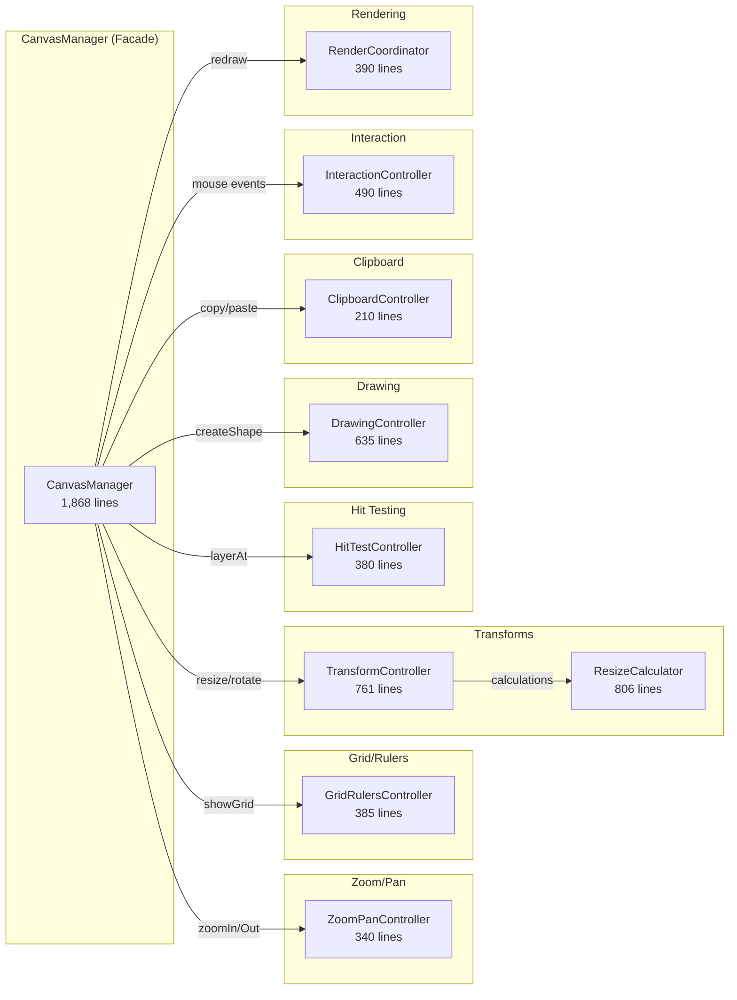
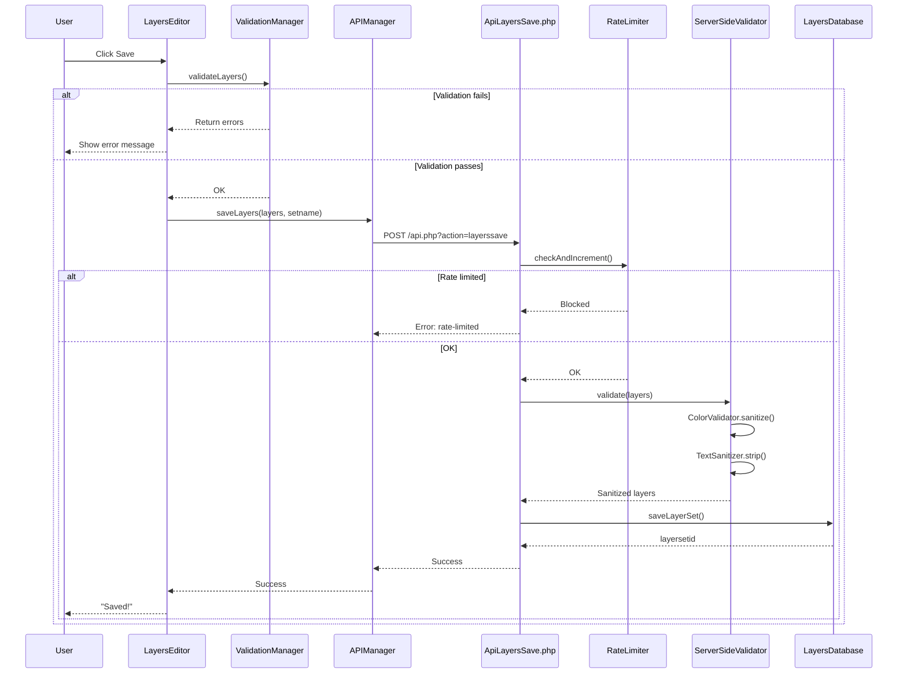
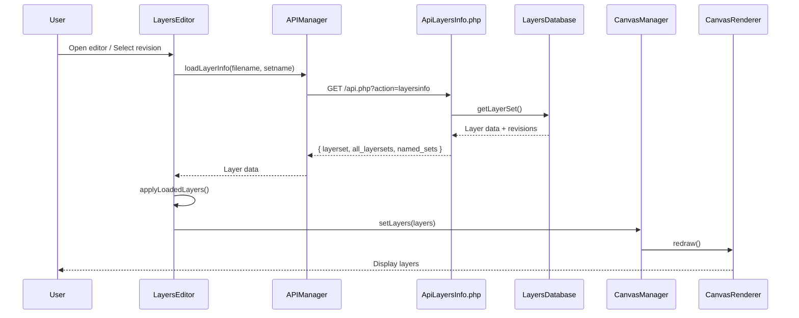
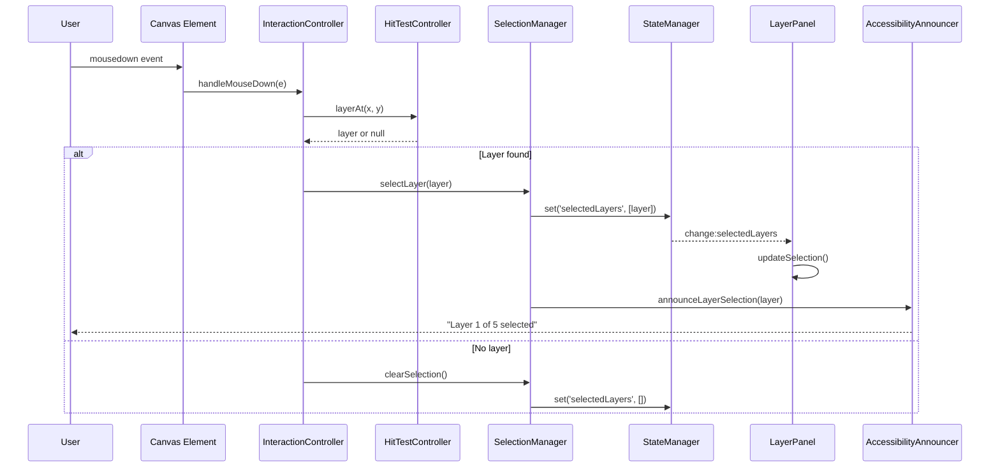
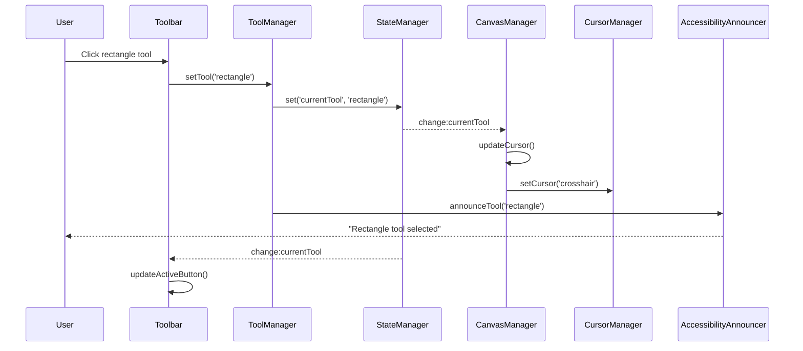

# Layers Extension Architecture

**Last Updated:** December 20, 2025  
**Version:** 1.1.7

This document explains the architectural decisions and patterns used in the Layers MediaWiki extension. It's intended for contributors (human and AI) working on the codebase.

---

## Overview

The Layers extension enables non-destructive image annotation in MediaWiki. It consists of:

1. **PHP Backend** - MediaWiki integration, API endpoints, data persistence
2. **JavaScript Frontend** - Canvas-based editor UI, viewer rendering

The architecture follows strict separation of concerns: PHP handles storage and MW integration; JavaScript handles all UI/state.

---

## Codebase Statistics (December 2025)

| Metric | Value |
|--------|-------|
| Total JS files | 90 |
| Viewer module | ~682 lines |
| Shared module | ~5,000 lines |
| Editor module | ~40,000 lines |
| Total JS lines | ~45,924 |
| ES6 classes | 81 |
| Prototype patterns | 0 (100% ES6) |
| Test coverage | ~92% statements, ~80% branches |
| Jest tests | ~5,695 |
| PHPUnit test files | 17 |
| God classes (>1000 lines) | **6** ⚠️ |
| Drawing tools | 14 |

---

### Recent Architecture Changes

### December 2025: Smart Guides & Arrange Menu

**v1.1.7 - Smart Guides & Cleanup:**
- New SmartGuidesController for intelligent object snapping
- Arrange dropdown menu consolidates 8 alignment buttons
- Removed EyedropperController (redundant with browser's native color picker)
- God classes reduced from 8 to 7

**v1.1.6 - Key Object Alignment:**
- Industry-standard alignment behavior (last selected = key object)
- ColorControlFactory and PresetStyleManager extracted
- Text layer alignment improvements

**v1.1.5 - Alignment & Style Presets:**
- AlignmentController for layer alignment/distribution
- Style presets system with save/load functionality
- Built-in presets for common annotation styles

**v1.1.0 - Text Box Tool:**
- New Text Box tool combining rectangle container with multi-line text
- Text stroke and text shadow effects
- Font family selection, bold/italic, alignment options

### Known Technical Debt

**6 files exceed 1,000 lines (god classes):**
- CanvasManager.js (1,868) - facade with 10+ controllers
- LayerPanel.js (1,837) - delegates to 7 controllers
- Toolbar.js (1,539) - UI controls consolidation
- LayersEditor.js (1,324) - main entry point
- ToolManager.js (1,264) - needs tool extraction
- SelectionManager.js (1,194) - core selection logic

**Recently under 1,000 (no longer god classes):**
- ShapeRenderer.js (857) - successfully refactored ✅
- ToolbarStyleControls.js (947) - style controls extracted ✅

See [improvement_plan.md](../improvement_plan.md) for remediation plan.

---

## Module Dependency Graph

### High-Level Architecture (Mermaid)

```mermaid
graph TB
    subgraph Entry["Entry Points"]
        init["init.js<br/>(viewer)"]
        editor["LayersEditor.js<br/>(orchestrator)"]
    end

    subgraph Viewer["Viewer (Article Pages)"]
        viewer["LayersViewer.js"]
        layerRenderer["LayerRenderer.js<br/>(shared)"]
    end

    subgraph Bootstrap["Editor Bootstrap"]
        bootstrap["EditorBootstrap"]
        revision["RevisionManager"]
        dialog["DialogManager"]
        announcer["AccessibilityAnnouncer"]
    end

    subgraph Registry["Module Registry"]
        state["StateManager"]
        event["EventManager"]
        history["HistoryManager"]
        validation["ValidationManager"]
        ui["UIManager"]
        api["APIManager"]
    end

    subgraph UI["User Interface"]
        toolbar["Toolbar"]
        keyboard["ToolbarKeyboard"]
        panel["LayerPanel"]
        styleControls["ToolbarStyleControls"]
    end

    subgraph Canvas["Canvas System"]
        canvasManager["CanvasManager<br/>(facade)"]
        canvasRenderer["CanvasRenderer"]
        selection["SelectionManager"]
    end

    subgraph Controllers["Canvas Controllers"]
        zoom["ZoomPanController"]
        grid["GridRulersController"]
        transform["TransformController"]
        hit["HitTestController"]
        drawing["DrawingController"]
        clipboard["ClipboardController"]
        interaction["InteractionController"]
        render["RenderCoordinator"]
        style["StyleController"]
        guides["SmartGuidesController"]
        alignment["AlignmentController"]
    end

    init --> viewer
    viewer --> layerRenderer
    editor --> bootstrap
    editor --> Registry
    editor --> UI
    editor --> Canvas

    bootstrap --> revision
    bootstrap --> dialog
    bootstrap --> announcer

    canvasManager --> canvasRenderer
    canvasManager --> selection
    canvasManager --> Controllers

    toolbar --> keyboard
    toolbar --> styleControls
```

### Controller Delegation Pattern



### ASCII Fallback (for non-Mermaid environments)

```
┌──────────────────────────────────────────────────────────────────────────────┐
│                              ENTRY POINTS                                      │
├──────────────────────────────────────────────────────────────────────────────┤
│  init.js (viewer)          LayersEditor.js (editor orchestrator)             │
└─────────┬────────────────────────────────┬───────────────────────────────────┘
          │                                │
          ▼                                ▼
┌─────────────────────┐     ┌──────────────────────────────────────────────────┐
│   LayersViewer.js   │     │              EDITOR BOOTSTRAP                     │
│   (article pages)   │     │  EditorBootstrap (init, hooks, cleanup)          │
│   LayerRenderer.js  │     │  RevisionManager (revisions, named sets)         │
│   (shared)          │     │  DialogManager (modals, ARIA)                    │
└─────────────────────┘     │  AccessibilityAnnouncer (screen reader support)  │
                            └───────────────────────┬──────────────────────────┘
                                                    │
                            ┌───────────────────────┼───────────────────────────┐
                            │                       │                           │
                            ▼                       ▼                           ▼
┌──────────────────────────────────┐    ┌─────────────────┐    ┌─────────────────────┐
│        MODULE REGISTRY           │    │    Toolbar      │    │    LayerPanel       │
│  UIManager, EventManager,        │    │ ToolbarKeyboard │    │ (keyboard nav)      │
│  APIManager, ValidationManager,  │    │                 │    │ (ARIA listbox)      │
│  StateManager, HistoryManager    │    └─────────────────┘    └─────────────────────┘
└───────────────────────┬──────────┘
                        │
                        ▼
               ┌─────────────────┐
               │  CanvasManager  │
               │   (facade)      │
               └────────┬────────┘
                        │
        ┌───────────────┼───────────────────────────────┐
        │               │                               │
        ▼               ▼                               ▼
┌───────────────┐  ┌────────────────────┐   ┌──────────────────────────────────┐
│CanvasRenderer │  │ SelectionManager   │   │        CONTROLLERS               │
│               │  │                    │   │  ZoomPanController               │
└───────────────┘  └────────────────────┘   │  GridRulersController            │
                                            │  TransformController             │
                                            │  HitTestController               │
                                            │  DrawingController               │
                                            │  ClipboardController             │
                                            │  InteractionController           │
                                            │  RenderCoordinator               │
                                            │  StyleController                 │
                                            └──────────────────────────────────┘
```

---

## Core Patterns

### 1. Module Registry Pattern

`LayersEditor` uses a `ModuleRegistry` to manage dependencies between components. Modules are initialized in order with dependency injection:

```javascript
// Module initialization order matters
const modules = [
    'StateManager',      // No dependencies
    'EventManager',      // No dependencies  
    'HistoryManager',    // Depends on StateManager
    'ValidationManager', // Depends on StateManager
    'UIManager',         // Depends on StateManager
    'APIManager',        // Depends on StateManager, UIManager
    // ...
];
```

Each module receives a reference to the editor and can access other modules via the registry.

### 2. Controller Extraction Pattern

`CanvasManager.js` acts as a **facade** that delegates to specialized controllers. This pattern was adopted to reduce class size from ~4000 lines to ~2000 lines while maintaining backward compatibility.

**Pattern:**
```javascript
// CanvasManager delegates to controller
CanvasManager.prototype.zoomIn = function() {
    return this.zoomPanController.zoomIn();
};

// Controller does the actual work
ZoomPanController.prototype.zoomIn = function() {
    this.setZoom(this.zoom * 1.25);
};
```

**Why this pattern?**
- Maintains backward compatibility (existing code calls `canvasManager.zoomIn()`)
- Enables focused testing of each controller
- Allows parallel development on different concerns
- Each controller can be understood in isolation

**Controllers extracted from CanvasManager:**
| Controller | Responsibility | Lines |
|------------|----------------|-------|
| ZoomPanController | Zoom, pan, fit-to-window | ~340 |
| GridRulersController | Grid, rulers, snap-to-grid | ~385 |
| TransformController | Resize, rotate, drag | ~761 |
| HitTestController | Click detection, selection | ~380 |
| DrawingController | Shape creation | ~635 |
| ClipboardController | Copy, cut, paste | ~210 |
| InteractionController | Mouse/touch events | ~490 |
| RenderCoordinator | Render scheduling | ~390 |
| StyleController | Style options | ~100 |
| ResizeCalculator | Shape resize calculations | ~806 |

### 3. Editor Module Extraction Pattern

`LayersEditor.js` uses a similar extraction pattern, delegating to specialized managers:

**Pattern:**
```javascript
// LayersEditor delegates to managers
LayersEditor.prototype.showRevisionDialog = function() {
    if (this.revisionManager) {
        return this.revisionManager.showRevisionDialog();
    }
};

// Manager handles the implementation
RevisionManager.prototype.showRevisionDialog = function() {
    // Complex dialog logic here
};
```

**Modules extracted from LayersEditor:**
| Module | Responsibility | Lines |
|--------|----------------|-------|
| EditorBootstrap | Initialization, hooks, cleanup, global error handling | ~400 |
| RevisionManager | Revision history, named layer sets, revision dialog | ~470 |
| DialogManager | Modal dialogs, confirmation dialogs, keyboard shortcuts help | ~420 |

**Integration:**
- EditorBootstrap handles initialization via `initHooks()`, `initGlobalErrorHandler()`, `initializeEditorUI()`
- RevisionManager manages revision dropdown, named set selection, history navigation
- DialogManager provides accessible modals with ARIA attributes and keyboard support

### 4. Accessibility Pattern

The `AccessibilityAnnouncer` provides centralized ARIA live region announcements:

```javascript
// Global announcer instance
const announcer = window.layersAnnouncer;

// Polite announcements (won't interrupt)
announcer.announce('Layer selected: Rectangle 1');

// Assertive announcements (immediate)
announcer.announceError('Failed to save: network error');

// Specialized methods
announcer.announceTool('rectangle');        // "Rectangle tool selected"
announcer.announceSuccess('layers-saved');  // "Layers saved successfully"
announcer.announceLayerSelection(layer, index, count);
```

**Where announcements are triggered:**
- `ToolManager.setTool()` → tool change announcements
- `SelectionManager.selectLayer()` → selection announcements
- `APIManager.saveLayers()` → save success announcements
- `ErrorHandler.createUserNotification()` → error announcements

**ARIA live regions:**
- `aria-live="polite"` - For non-urgent status updates
- `aria-live="assertive"` - For errors and important alerts

### 5. StateManager / Editor Bridge Pattern

The `StateManager` provides a centralized state container with pub/sub notifications:

```javascript
// Setting state
stateManager.set('currentTool', 'rectangle');

// Getting state
const tool = stateManager.get('currentTool');

// Subscribing to changes
stateManager.on('change:currentTool', (newTool) => {
    toolbar.setActiveTool(newTool);
});
```

This pattern enables:
- Loose coupling between components
- Predictable state flow
- Easy debugging (can log all state changes)
- Undo/redo implementation via HistoryManager

### 6. MessageHelper Pattern (i18n)

All user-facing strings use MediaWiki's i18n system via a centralized `MessageHelper`:

```javascript
// Good: Use MessageHelper singleton
const msg = window.layersMessages.get('layers-save-success', 'Saved!');

// Good: Each class can have a getMessage() wrapper
getMessage(key, fallback) {
    return window.layersMessages.get(key, fallback);
}

// Avoid: Direct mw.message calls outside MessageHelper
// (These are only acceptable as fallbacks in getMessage())
```

**Why centralize?**
- Single point for caching
- Consistent fallback handling
- Easier to mock in tests
- Future-proof for ES module migration

### 7. PHP LoggerAwareTrait Pattern

PHP classes use traits for consistent logging:

```php
// For instance methods
use LoggerAwareTrait;

public function someMethod() {
    $this->getLogger()->debug('Processing...');
}

// For static methods
use StaticLoggerAwareTrait;

public static function someStaticMethod() {
    self::getStaticLogger()->debug('Processing...');
}
```

---

## Namespace Strategy

### Current State (Complete)

All JavaScript modules export to organized namespaces:

```javascript
// Namespaced exports (215 instances):
window.Layers.Canvas.Manager = CanvasManager;
window.Layers.Utils.PolygonGeometry = PolygonGeometry;
window.Layers.ShadowRenderer = ShadowRenderer;
window.Layers.UI.LayerItemFactory = LayerItemFactory;

// 0 legacy direct exports remain
```

### Namespace Structure

```javascript
window.Layers = {
    VERSION: '0.8.5',
    Editor: LayersEditor,
    Core: { StateManager, HistoryManager, EventManager, ModuleRegistry, Constants },
    UI: { Manager, Toolbar, LayerPanel, ColorPickerDialog, PropertiesForm, LayerItemFactory },
    Canvas: { Manager, Renderer, SelectionManager, DrawingController, ... },
    Utils: { Geometry, Text, ImageLoader, ErrorHandler, EventTracker, PolygonGeometry },
    Validation: { LayersValidator, ValidationManager }
};
```

---

## Data Flow

### Save Flow (Mermaid)



### Load Flow (Mermaid)



### ASCII Fallback (for non-Mermaid environments)

**Save Flow:**
```
User clicks Save
       │
       ▼
LayersEditor.saveCurrentSet()
       │
       ▼
ValidationManager.validateLayers() ──► Returns errors if invalid
       │
       ▼
APIManager.saveLayers()
       │
       ▼
POST /api.php?action=layerssave
       │
       ▼
ApiLayersSave.php
       │
       ├── RateLimiter.checkAndIncrement()
       ├── ServerSideLayerValidator.validate()
       │   ├── ColorValidator (sanitize colors)
       │   └── TextSanitizer (strip HTML/scripts)
       └── LayersDatabase.saveLayerSet()
              │
              ▼
         MySQL/MariaDB (layers_layersets table)
```

**Load Flow:**
```
Page load / user selects revision
       │
       ▼
LayersEditor.loadLayerSet()
       │
       ▼
APIManager.loadLayerInfo()
       │
       ▼
GET /api.php?action=layersinfo&filename=...
       │
       ▼
ApiLayersInfo.php
       │
       └── LayersDatabase.getLayerSet()
              │
              ▼
         MySQL/MariaDB
              │
              ▼
         Return JSON: { layerset: {...}, all_layersets: [...] }
       │
       ▼
LayersEditor.applyLoadedLayers()
       │
       ▼
CanvasManager.setLayers() → CanvasRenderer.redraw()
```

---

## Event Flow

### User Interaction Flow (Mermaid)

This diagram shows how a user action (like clicking to select a layer) propagates through the system:



### Tool Change Flow



---

## Testing Architecture

### Unit Tests (Jest)

```
tests/jest/
├── BasicLayersTest.test.js     # Sanity checks
├── CanvasManager.test.js       # Core canvas tests
├── ZoomPanController.test.js   # Controller-specific
├── SelectionManager.test.js    # Selection logic
├── integration/                # Multi-module tests (138 tests)
│   ├── SelectionWorkflow.test.js (44 tests)
│   ├── LayerWorkflow.test.js (70 tests)
│   └── SaveLoadWorkflow.test.js (24 tests)
└── RegressionTests.test.js     # Bug fix validation
```

**Key patterns:**
- Each controller has its own test file (92 test files total)
- Mock MediaWiki globals in `__mocks__/mw.js`
- Mock canvas context for DOM-free testing
- Integration tests verify multi-module workflows
- 4,714 tests, 91% coverage

### E2E Tests (Playwright)

```
tests/e2e/
└── layers.spec.js    # Full editor workflow tests
```

E2E tests run against a real MediaWiki installation in CI.

---

## File Organization

```
extensions/Layers/
├── extension.json           # MW manifest
├── services.php             # DI container setup
├── src/                     # PHP backend
│   ├── Api/                 # API modules
│   ├── Database/            # Data access
│   ├── Hooks/               # MW hook handlers
│   ├── Logging/             # LoggerAwareTrait, etc.
│   ├── Security/            # RateLimiter
│   └── Validation/          # Server-side validators
├── resources/
│   ├── ext.layers/          # Viewer (article pages)
│   │   ├── init.js
│   │   └── LayersViewer.js
│   ├── ext.layers.shared/   # Shared modules (3,888 lines)
│   │   ├── LayerRenderer.js     # Facade/dispatcher (371 lines)
│   │   ├── ShapeRenderer.js     # Shape rendering (1,050 lines)
│   │   ├── ArrowRenderer.js     # Arrow rendering (702 lines)
│   │   ├── ShadowRenderer.js    # Shadow effects (521 lines)
│   │   ├── TextRenderer.js      # Text rendering (343 lines)
│   │   ├── EffectsRenderer.js   # Blur effects (245 lines)
│   │   ├── BoundsCalculator.js  # Layer bounds (340 lines)
│   │   └── PolygonGeometry.js   # Polygon math (213 lines)
│   └── ext.layers.editor/   # Editor (~31,881 lines)
│       ├── LayersEditor.js  # Main orchestrator (1,284 lines)
│       ├── CanvasManager.js # Canvas facade (1,975 lines)
│       ├── AccessibilityAnnouncer.js  # ARIA live regions
│       ├── editor/          # Extracted editor modules
│       │   ├── EditorBootstrap.js   # Init, hooks, cleanup
│       │   ├── RevisionManager.js   # Revision management
│       │   └── DialogManager.js     # Modal dialogs
│       ├── canvas/          # Extracted controllers (11 files)
│       │   ├── ZoomPanController.js
│       │   ├── GridRulersController.js
│       │   ├── TransformController.js
│       │   ├── ResizeCalculator.js
│       │   ├── HitTestController.js
│       │   ├── DrawingController.js
│       │   ├── ClipboardController.js
│       │   ├── InteractionController.js
│       │   ├── RenderCoordinator.js
│       │   └── StyleController.js
│       └── *.js             # Other modules
├── tests/
│   ├── jest/                # Unit tests (4,300 tests, 87 files)
│   ├── e2e/                 # End-to-end tests
│   └── phpunit/             # PHP tests (17 files)
└── docs/                    # Documentation
```

---

## Configuration

### PHP Configuration (LocalSettings.php)

```php
$wgLayersEnable = true;              // Master switch
$wgLayersDebug = true;               // Verbose logging
$wgLayersMaxBytes = 2097152;         // 2MB max JSON
$wgLayersMaxLayerCount = 100;        // Max layers per set
$wgLayersMaxNamedSets = 15;          // Max named sets per image
$wgLayersMaxRevisionsPerSet = 50;    // Max revisions kept

// Rate limits
$wgRateLimits['editlayers-save']['user'] = [30, 3600];
$wgRateLimits['editlayers-save']['newbie'] = [5, 3600];
```

### Permissions

| Right | Default | Description |
|-------|---------|-------------|
| editlayers | users | Edit existing layers |
| createlayers | autoconfirmed | Create new layer sets |
| managelayerlibrary | sysop | Library management |

---

## Accessibility Architecture

The editor implements WCAG 2.1 AA compliance through several mechanisms:

### Keyboard Navigation

**Toolbar:**
- Tab to navigate between toolbar groups
- Arrow keys within groups
- Enter/Space to activate tools
- Escape to deselect
- Shift+? to show keyboard shortcuts help

**Layer Panel:**
- Arrow Up/Down to navigate layers
- Home/End to jump to first/last
- Enter/Space to select
- V to toggle visibility
- L to toggle lock
- Delete to remove layer

**Canvas:**
- Arrow keys for precise positioning
- Shift+Arrow for larger moves
- Ctrl+C/V/X for clipboard
- Ctrl+Z/Y for undo/redo

### ARIA Support

**Live Regions:**
The `AccessibilityAnnouncer` creates two live regions:
- `aria-live="polite"` - For status updates that can wait
- `aria-live="assertive"` - For errors that need immediate attention

**Widget Roles:**
- Layer list: `role="listbox"` with `role="option"` items
- Layer items: `aria-selected`, `aria-label` with layer info
- Dialogs: `role="dialog"`, `aria-labelledby`, `aria-modal="true"`
- Tools: Buttons with `aria-label` descriptions

### Focus Management

- Focus trapped within modal dialogs
- Focus restored to trigger element on dialog close
- Visible focus indicators (`:focus-visible` styling)
- Logical tab order maintained

---

## Migration Notes

### From Legacy Globals

When updating code that uses legacy globals:

```javascript
// Old (deprecated)
const canvas = new window.CanvasManager(options);

// New (preferred)
const canvas = new window.Layers.Canvas.Manager(options);

// Both work during transition period
```

### Adding New Modules

1. Create module in appropriate directory
2. Add exports for both browser and Node.js
3. Register in `extension.json` ResourceModules
4. Add to appropriate namespace in `LayersNamespace.js`
5. Write tests (target 90%+ coverage)

---

## Related Documentation

- [ACCESSIBILITY.md](./ACCESSIBILITY.md) - Full accessibility documentation
- [NAMED_LAYER_SETS.md](./NAMED_LAYER_SETS.md) - Named sets architecture
- [DEVELOPER_ONBOARDING.md](./DEVELOPER_ONBOARDING.md) - Getting started
- [CSP_GUIDE.md](./CSP_GUIDE.md) - Content Security Policy
- [canvas/README.md](../resources/ext.layers.editor/canvas/README.md) - Controller details
- [copilot-instructions.md](../.github/copilot-instructions.md) - Contributor guide
